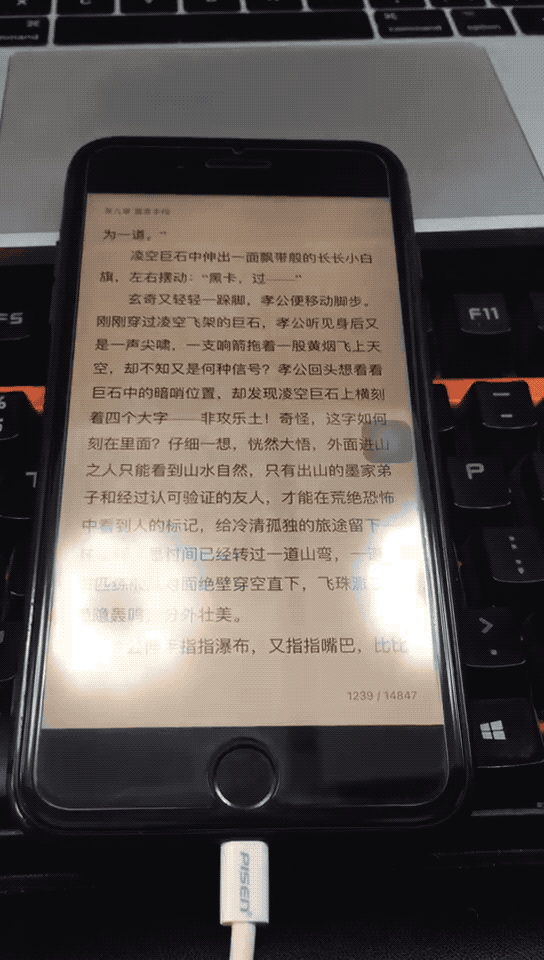

# weread-ios-auto

需要 iOS + macOS，请参考下面的配置

使用[真机调试 WDA，参考 iOS 真机如何安装](https://testerhome.com/topics/7220)

安装 [openatx/facebook-wda](https://github.com/openatx/facebook-wda)

手机打开微信阅读界面

点开要刷的书籍（推荐大秦帝国合订本，比较厚），关闭想法（防止程序误点）

然后运行 python wereadauto.py 即可

## 成果展示

## 灵感来源
[weread-auto](https://github.com/tqcenglish/weread-auto)